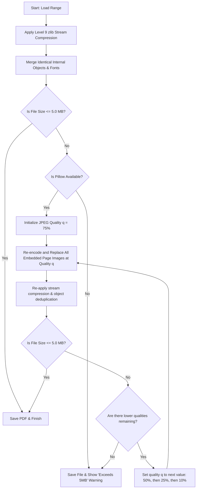

# PDF Page Extractor & Splitter - Comprehensive Documentation

Welcome to the documentation for the **PDF Page Extractor & Splitter** application. This document details the application's functionality, its codebase architecture, the inner workings of its compression pipeline, and how to compile or execute it.

---

## Table of Contents
1. [Overview](#1-overview)
2. [Key Features](#2-key-features)
3. [File Structure Directory](#3-file-structure-directory)
4. [Source Code Structure & Section Explanations](#4-source-code-structure--section-explanations)
    - [Section 1: Imports and Dependency Checks](#section-1-imports-and-dependency-checks)
    - [Section 2: Core PDF Compression & Extraction Engine](#section-2-core-pdf-compression--extraction-engine)
    - [Section 3: Modern CustomTkinter User Interface Class](#section-3-modern-customtkinter-user-interface-class)
    - [Section 4: Standard Tkinter Fallback User Interface Class](#section-4-standard-tkinter-fallback-user-interface-class)
    - [Section 5: App Entry Point](#section-5-app-entry-point)
5. [The Compression Pipeline Deep-Dive](#5-the-compression-pipeline-deep-dive)
6. [Building & Packaging the Executable](#6-building--packaging-the-executable)
7. [Running the Program](#7-running-the-program)

---

## 1. Overview
The **PDF Page Extractor & Splitter** is a lightweight, modern, and highly portable desktop application written in Python. It is designed to solve a common administrative problem: extracting specific page ranges from a large PDF and splitting them into multiple parts (e.g., extracting pages 5–15 and dividing them into 3 separate files) while strictly enforcing a file size limit of **5.0 MB** per output file.

---

## 2. Key Features
*   **Intuitive Layout**: Start Page, End Page, and Parts fields are arranged side-by-side on a single, easy-to-read line.
*   **Dual-mode Extraction**:
    *   **Single File Mode (Parts = 1)**: Extracts the page range into one compressed PDF.
    *   **Multi-Part Mode (Parts > 1)**: Divides the selected range into $N$ files, automatically distributing the pages as evenly as possible.
*   **Dual GUI Framework**:
    *   **Modern Mode**: Rendered using CustomTkinter with responsive dark/light mode integration.
    *   **Fallback Mode**: Automatically switches to a customized, clean Tkinter (TTK) styling if the modern library is missing, preventing startup crashes.
*   **Smart Size Control**: Progressive multi-phase compression to fit files under 5MB.
*   **Zero-Dependency Standalone Executable**: Can be run on any Windows computer without installing Python or libraries.

---

## 3. File Structure Directory
Below is the directory layout of the project workspace:

```text
c:\Users\Anobis\Desktop\Projects\
│
├── pdf_extractor.py          # Main Python source code (fully commented)
├── pdf_extractor.spec        # PyInstaller specification file for compilation
├── run.bat                   # Batch script launcher for double-click execution
│
├── dist/                     # Target directory for the executable
│   └── pdf_extractor.exe     # Standalone portable Windows executable (~19.6MB)
│
└── build/                    # Temporary PyInstaller compilation build files
```

---

## 4. Source Code Structure & Section Explanations

The source code in [pdf_extractor.py](file:///c:/Users/Anobis/Desktop/Projects/pdf_extractor.py) is modularized into 5 distinct, well-commented sections. Below is a detailed breakdown of the purpose and operations of each section.

### Section 1: Imports and Dependency Checks
*   **Purpose**: Safely loads standard Python libraries and checks for the availability of external libraries (`pypdf`, `Pillow`, `customtkinter`).
*   **Key Logic**:
    *   Imports `os`, `sys`, and `io` to handle system paths and memory buffers.
    *   Attempts to load `pypdf` for core PDF operations. If it fails, it sets `PYPDF_AVAILABLE = False` and handles the absence gracefully.
    *   Attempts to load `Pillow` (PIL) for image manipulation. If missing, it sets `PILLOW_AVAILABLE = False`, disabling lossy image downscaling but allowing basic PDF splitting.
    *   Attempts to load `customtkinter` for modern UI aesthetics. If missing, it falls back to standard `tkinter` (`tk` and `ttk`), setting `USE_CUSTOM_TK = False`.
*   **Significance**: This section guarantees that the program launches regardless of the host machine's configuration.

### Section 2: Core PDF Compression & Extraction Engine
*   **Purpose**: Implements the `extract_and_compress_pdf` function, which performs the physical splitting and size-reduction computations.
*   **Key Logic**:
    1.  **Extraction**: Reads the input PDF, adjusts page indexing (since PDFs are 0-indexed and user input is 1-indexed), and writes the selected range into a new buffer.
    2.  **Lossless Compression**: Invokes `page.compress_content_streams(level=9)` to deflate textual and graphics layout instructions.
    3.  **Deduplication**: Runs `writer.compress_identical_objects()` to identify and merge shared resources (such as common fonts or repeated background graphics).
    4.  **Verification**: Evaluates the output size. If it's under 5.0 MB, it immediately saves.
    5.  **Lossy Compression (If Over 5MB)**: Loops through JPEG quality steps (`75%`, `50%`, `25%`, `10%`). For each step, it iterates through all embedded images on each page, replaces them with lower-quality copies using Pillow, and re-checks the file size.
*   **Significance**: This function contains the core logic and runs independent of the GUI class, making it easy to test or repurpose.

### Section 3: Modern CustomTkinter User Interface Class
*   **Purpose**: Implements the `PDFExtractorApp` class when `USE_CUSTOM_TK` is `True`.
*   **Key Widgets & Operations**:
    *   Configures the application window (`600x430` size, non-resizable, dark/light theme integration).
    *   **Choose PDF Button**: Invokes `choose_file()`, which opens a file browser dialog, extracts the page count from the loaded document, and unlocks the editing fields.
    *   **Input Row**: Configures three aligned `CTkEntry` fields side-by-side (`Start Page`, `End Page`, and `Parts`).
    *   **Action Button**: Triggers `export_pdf()`, which validates inputs, requests output names, and runs the extraction function.
*   **Significance**: Implements the modern, modern-themed GUI dashboard.

### Section 4: Standard Tkinter Fallback User Interface Class
*   **Purpose**: Implements the `PDFExtractorApp` class when `USE_CUSTOM_TK` is `False`.
*   **Key Logic**:
    *   Replicates the exact same window geometry, variables, buttons, entries, and validation methods as Section 3.
    *   Applies a customized `ttk.Style` config using a light gray background (`#f0f2f5`), dark charcoal text, and crisp Segoe UI typography to retain a high-quality presentation.
*   **Significance**: Serves as a failsafe so that the utility remains functional even if modern GUI packages are missing from the host Python environment.

### Section 5: App Entry Point
*   **Purpose**: Initializes and boots the GUI.
*   **Key Logic**:
    *   Uses `if __name__ == "__main__":` to check if the script is being executed directly.
    *   Instantiates `PDFExtractorApp` and triggers the Tkinter main event listener loop (`app.mainloop()`).

---

## 5. The Compression Pipeline Deep-Dive
The flowchart below illustrates how the program optimizes output file sizes:



---

## 6. Building & Packaging the Executable
The portable executable file in `dist/pdf_extractor.exe` was created using **PyInstaller**. If you make changes to `pdf_extractor.py` and want to compile a new executable, follow these instructions:

### Prerequisites
Make sure Python is installed and run:
```bash
pip install customtkinter pypdf Pillow pyinstaller
```

### Build Command
Run this command in the terminal inside your workspace directory (`c:\Users\Anobis\Desktop\Projects`):
```powershell
pyinstaller --onefile --noconsole --collect-all customtkinter pdf_extractor.py
```

### Command Flags Breakdown
*   `--onefile`: Bundles the Python interpreter, dependencies, and code into a single, portable `.exe` file.
*   `--noconsole`: Hides the command prompt window in the background when double-clicking the application.
*   `--collect-all customtkinter`: Forces PyInstaller to search for and bundle CustomTkinter's assets (JSON theme files, fonts, and assets) directly into the executable.

---

## 7. Running the Program
There are three ways to launch this tool:

1.  **Via Launcher**: Double-click **`run.bat`** in the root workspace folder. This script automatically checks if the compiled executable exists and runs it; otherwise, it runs the raw script using Python.
2.  **Via Executable**: Double-click **`dist/pdf_extractor.exe`**.
3.  **Via Python**: Open a terminal and execute:
    ```bash
    python pdf_extractor.py
    ```
